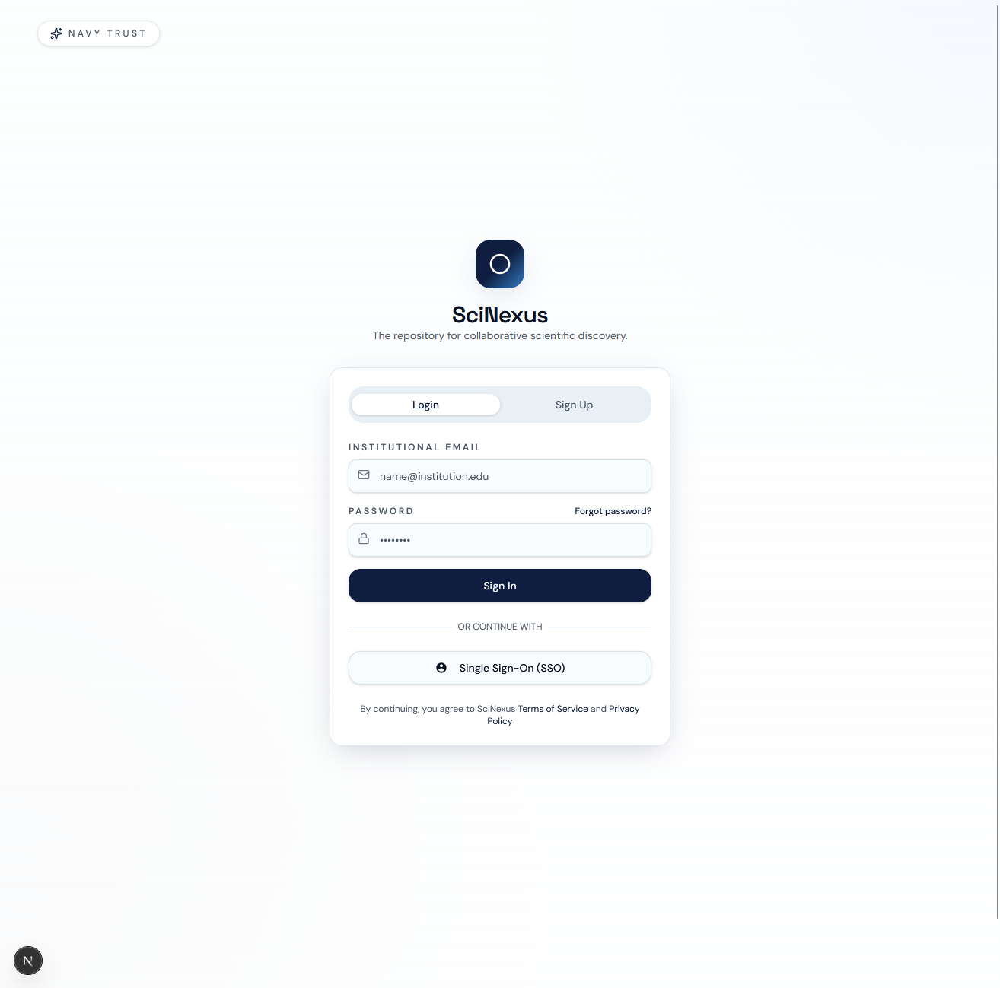
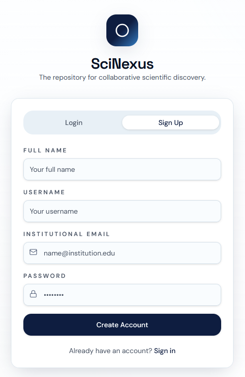

# 🔬 SciNexus - Plataforma de Gestão Científica e Peer Review


**Universidade Federal de Alagoas (UFAL)** **Disciplina:** Engenharia de Software  
**Autor:** Filipe Simões Mota  

---

## 📌 Sobre o Projeto
O **SciNexus** é uma plataforma digital distribuída projetada para a orquestração completa de eventos científicos, congressos e simpósios. Nascido para resolver os gargalos de plataformas acadêmicas legadas, o sistema automatiza desde a submissão de trabalhos científicos (*papers*) até o rigoroso fluxo de revisão por pares (*peer-review*).

O projeto foi arquitetado com foco extremo em escalabilidade e manutenibilidade, aplicando o padrão de **Microsserviços** no backend (com bancos de dados isolados) e o padrão **BFF (Backend-For-Frontend)** no cliente para consumo centralizado das APIs.

---

## 📸 Telas da Aplicação

## 📸 Telas da Aplicação

### 🔐 Autenticação e Acesso
<div align="center">
  
  
</div>
<br>

### 🌍 Navegação e Descoberta
<div align="center">
  
  
</div>
<br>

### 📅 Gestão de Congressos e Simpósios
<div align="center">
  
  
</div>
<br>

### 🔬 Fluxo Científico e Revisão por Pares
<div align="center">
  
  
</div>
<br>

### 📊 Histórico e Acompanhamento
<div align="center">
  
</div>

---

## 🚀 Principais Funcionalidades

* **Gestão de Identidade:** Autenticação stateless via JWT.
* **Catálogo de Eventos:** CRUD completo para organizadores e vitrine de eventos para ouvintes.
* **Motor de Submissões:** Suporte a upload seguro de arquivos em nuvem/disco (`multipart/form-data`) para PDFs científicos.
* **Painel de Peer-Review:** Workflow de avaliação de artigos com máquina de estados rigorosa (`SUBMETIDO`, `EM_REVISAO`, `APROVADO`, `REJEITADO`) e sistema de feedback técnico.
* **🧠 Inteligência de Recomendação:** Motor de sugestão de revisores (*Content-Based Filtering*) construído com **Coeficiente de Jaccard**, cruzando palavras-chave dos artigos com a expertise do corpo científico.

---

## 📦 Arquitetura de Microsserviços e Stack Tecnológica

O ecossistema é dividido em serviços independentes, comunicando-se via REST, aplicando o princípio de *Database per Service*:

| Serviço | Porta | Tecnologias Principais | Banco de Dados | Responsabilidade |
| :--- | :--- | :--- | :--- | :--- |
| **`auth-service`** | `8001` | FastAPI, Python, Pydantic | PostgreSQL (auth_db) | Identidade e Tokens JWT |
| **`event-service`** | `8002` | FastAPI, Python, SQLAlchemy | PostgreSQL (event_db) | Eventos e Inscrições |
| **`submission-service`** | `8003` | FastAPI, Python, Alembic | PostgreSQL (sub_db) | PDFs, Recomendações e Pareceres |
| **`frontend (BFF)`** | `3000` | Next.js, React, Tailwind, shadcn | N/A | UI e API Gateway nativo |

> **Nota de Infraestrutura:** O projeto utiliza o gerenciador **`uv` (Astral)** para resolução e instalação de dependências em Rust, garantindo builds de contêineres ultrarrápidos e determinísticos.


---

## 🛠️ Como Executar o Projeto Localmente

**Pré-requisitos:**
* Docker e Docker Compose instalados.
* Node.js v18+.
* Utilitário `make` nativo do sistema (Linux/Mac) ou WSL (Windows).

### Opção 1: Execução Total via Docker (Recomendado)

O projeto conta com um `Makefile` configurado para orquestrar toda a infraestrutura com comandos simples.

1. Clone o repositório:
   ```bash
   git clone [https://github.com/FSMota/scinexus.git](https://github.com/FSMota/scinexus.git)
   cd scinexus
   ```

2. Suba toda a malha de microsserviços e o banco de dados:
   ```bash
   make start
   ```
   *Este comando construirá as imagens de todos os serviços usando o `uv` e aplicará as migrações automaticamente.*

3. Para acompanhar os logs em tempo real:
   ```bash
   make logs
   ```

4. Em outro terminal, inicie o cliente Frontend (Gateway):
   ```bash
   cd frontend
   npm install
   npm run dev
   ```
   Acesse a plataforma em: `http://localhost:3000`

### Opção 2: Comandos de Manutenção Úteis
```bash
make db-up         # Sobe apenas o PostgreSQL
make run-auth      # Roda o serviço de Auth localmente (via uv run) com hot-reload
make clean         # Derruba os contêineres e limpa os volumes de banco de dados
make ps            # Lista os serviços ativos na rede Docker
```

---

## 📄 Documentação Inteligente (OpenAPI / Swagger)

Como os serviços não utilizam um monolito, as APIs de cada domínio são autodocumentadas seguindo a especificação **OpenAPI**. Com a infraestrutura rodando, você pode testar as rotas, injetar tokens e analisar os esquemas de validação interativamente através do **Swagger UI**:

* **Auth API Docs:** [http://localhost:8001/docs](http://localhost:8001/docs)
* **Event API Docs:** [http://localhost:8002/docs](http://localhost:8002/docs)
* **Submission API Docs:** [http://localhost:8003/docs](http://localhost:8003/docs)


---
*Desenvolvido como MVP para aprovação na disciplina de Engenharia de Software - 2024.*
